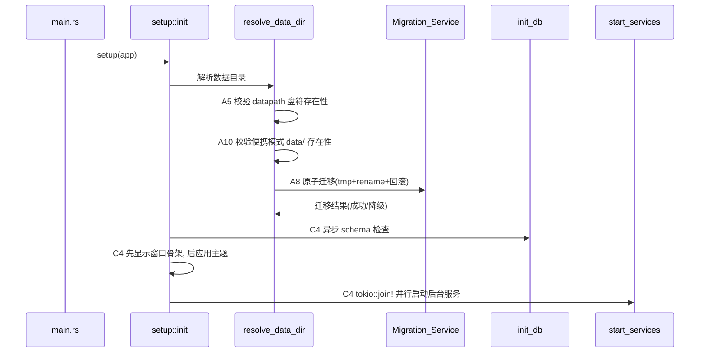
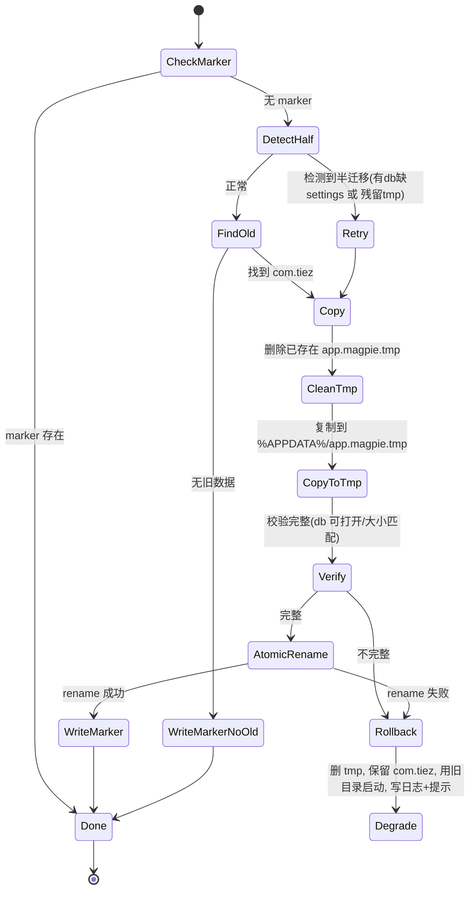

# 设计文档：Magpie v0.4.1

## Overview

本设计文档面向 Magpie v0.4.1（主题：Stability + UX + UI 升级），将 `requirements.md` 中 41 条需求落地到现有 Tauri 2 + Rust + React 19 + TypeScript 代码库。设计的核心原则：

- **复用优先**：所有改动尽量在现有模块内完成（`migration.rs`、`system_cmd.rs`、`clipboard/pipeline.rs`、`tag_repo.rs`、`hotkey_cmd.rs`、`hooks/mod.rs`、各 `*SettingsGroup.tsx`），不引入平行实现。
- **兼容字段零触碰**：`tiez.log`、`<!--TIEZ_RICH_IMAGE:`、`tiez-sync`、`tiez_xxx` localStorage、`tiez/tiez_xxx` MQTT topic 保持原样（需求 36）。所有新增日志、迁移标记、配置 key 都不修改这些标识符。
- **数据 100% 无损**：v0.4.0 → v0.4.1 不重置任何用户数据；DB schema 仅以 additive migration 演进；快捷键缺字段时按 `Global` 兜底（需求 39）。
- **仅 Windows**：除需求 9（A7）的 additive CSS 外，全部功能仅在 Windows 实现与验证（需求 38）。
- **不牺牲运行性能**：构建配置保持 `lto`/`strip`/`codegen-units=1`，不启用 `opt-level="z"`（需求 37）。当前 `Cargo.toml` 为 `opt-level = "s"`，符合约束，保持不变。

v0.4.1 不是新建系统，而是对成熟代码库的一次巩固 + 增强迭代。因此本设计以「现有文件 → 改造点 → 新增接口」的方式组织，确保 41 条需求每条都能定位到代码落点。

### 五类工作与需求映射

| 类别 | 需求编号 | 主题 |
|------|----------|------|
| A 迁移巩固/Hotfix | 1–9（A2/A3/A4/A6/A8/A9/A10/A7） | 卸载体验、迁移日志、更新错误分类、datapath 健康检查、教程链接、迁移回滚、诊断导出、自启动修复、Mac 样式兜底 |
| U 上游 bug 借鉴 | 10–14（U1–U5） | 空白内容捕获、标签合并、滚轮穿透、多屏、IME 25H2 |
| F UX 增强 | 15–19（F1–F5） | 快速打标签、数字快捷粘贴、敏感标记、表情包、快捷键 scope |
| C 性能/稳定性 | 20–27（C1/C2/C3/C4/C5/C6/C8/C9） | 基准、大列表、内存、启动、Win+V 接管、panic、CI cache、测试体系 |
| V UI 升级 | 28–35（V1–V8） | 空状态、Toast、图标、卡片密度、面板重组、截图、README |
| 非功能约束 | 36–41 | 兼容字段、性能手段、平台、零回归、署名、优先级 |

## Architecture

### 系统分层与改动落点

```mermaid
graph TB
    subgraph Frontend["前端 React (src/)"]
        SP["features/settings<br/>SettingsPanel + groups"]
        CL["features/clipboard<br/>VirtualClipboardList / ClipboardItem"]
        TAG["features/tag<br/>浮动标签输入(新)"]
        EMO["features/emoji<br/>EmojiPanel"]
        SHK["shared/hooks<br/>useHotkeyConfig / useClipboardActions"]
        TOAST["shared/components<br/>ToastContainer"]
        LOC["locales.ts (zh/en/zh-TW)"]
    end

    subgraph Backend["后端 Rust (src-tauri/src/)"]
        MAIN["main.rs<br/>invoke_handler 注册"]
        SETUP["app/setup.rs<br/>启动流程 / 数据路径"]
        MIG["migration.rs<br/>v040 迁移(改造)"]
        SYS["app/commands/system_cmd.rs<br/>autostart / Win+V"]
        HK["app/commands/hotkey_cmd.rs<br/>+ app/hooks/mod.rs<br/>快捷键 scope 分流"]
        PIPE["services/clipboard/pipeline.rs<br/>+ utils.rs 捕获/去重"]
        TAGR["infrastructure/repository<br/>tag_repo / clipboard_repo"]
        DIAG["诊断导出(新模块)"]
        PANIC["logger.rs + panic_hook(新)"]
        DB["database.rs + migrations.rs"]
    end

    subgraph External["系统 / 外部"]
        REG["HKCU 注册表<br/>Run / DisabledHotkeys"]
        FS["%APPDATA%\\app.magpie<br/>+ 便携 data/"]
        GH["GitHub Releases / 教程"]
    end

    SP -->|invoke| SYS
    SP -->|invoke| HK
    CL -->|invoke| TAGR
    TAG -->|invoke update_tags| TAGR
    EMO -->|invoke| DIAG
    SHK --> HK
    SYS --> REG
    SETUP --> MIG
    MIG --> FS
    PIPE --> TAGR
    TAGR --> DB
    PANIC --> FS
    SP -->|更新检查| GH
```



### 启动序列（受 C4 / A4 / A8 / A10 影响）

`setup::init` 当前为顺序执行。v0.4.1 在保持顺序语义正确的前提下做并行化与健壮性增强：



### 关键约束在架构中的体现

- **单实例迁移互斥（A8.3）**：依赖已注册的 `tauri_plugin_single_instance`，迁移逻辑运行在 `setup::init` 内，单实例插件保证同一时刻只有一个进程执行迁移。
- **autostart 单一来源（A10）**：删除 `system_cmd.rs` 的注册表直写，统一走 `tauri_plugin_autostart` 的 `AutoLaunchManager`（`app.autolaunch()`），前端命令名保留。
- **Win+V 唯一判定源（C5）**：以 `HKCU\...\Explorer\Advanced\DisabledHotkeys` 是否含 `V` 为唯一真相，UI 状态读注册表反推。

## Components and Interfaces

按需求的 A / U / F / C / V 分类组织。每个组件标注：涉及的现有文件、新增文件、Rust 命令签名或前端组件接口。

---

### A 类：迁移巩固 / Hotfix

#### A2（需求 1）卸载体验改善 — NSIS_Uninstaller

- **落点**：`src-tauri/tauri.windows.conf.json` 的 `bundle.windows.nsis` 增加自定义 `installerHooks`（NSIS `!macro` 模板）。新增文件 `src-tauri/nsis/hooks.nsh`。
- **方案**：
  - 在 `NSIS_HOOK_PREUNINSTALL` 宏中检测 Magpie 进程：通过 `FindWindow`/`nsExec` 调用 `tasklist` 判断 `Magpie.exe` 是否运行。
  - 交互卸载（`${UNINSTALL_MODE}` 非 silent）：进程在跑则 `MessageBox` 中文「请先关闭 Magpie 后重试」并 `Abort`（终止卸载）。
  - 静默卸载（命令行含 `/S`）：跳过弹窗；若进程在跑，向主窗口发送 `WM_CLOSE`（`SendMessage`），轮询 5 秒；超时则 `taskkill /F /IM Magpie.exe`。
- **接口**：纯 NSIS 脚本，无 Rust/前端接口。tauri.conf 引用：`"nsis": { "installerHooks": "./nsis/hooks.nsh", ... }`。

#### A3（需求 2）迁移日志可见性 — Migration_Service

- **落点**：`src-tauri/src/migration.rs` 的 `perform_migration_v040`。
- **方案**：迁移开始时（确定 `old_dir`、`default_app_dir` 后）向 `tiez.log` 写入一行：
  `[MIGRATION v040] from={old_dir} to={target_dir} db_size={bytes}`。
  当前用 `println!`，改为 `crate::info!`（logger 已在迁移前初始化吗？见下）。
- **顺序依赖**：`logger::init` 在 `resolve_data_dir` **之后**调用（setup.rs:60 区段），而迁移在 `resolve_data_dir` **之内**。因此迁移阶段 logger 尚未初始化。解决：迁移函数改为接收一个「日志写入闭包」或直接对 `default_app_dir.join("tiez.log")` 以追加模式写入（迁移目标日志路径已知）。采用后者：迁移内部用 `std::fs::OpenOptions::append` 直接写 `tiez.log`，与 logger 输出同文件、互不冲突。

#### A4（需求 3）更新检查错误分类 — Update_Checker

- **落点**：前端 `src/shared/hooks/useAutoUpdate.ts` + `UpdateDialog.tsx`；错误文案进 `locales.ts`。
- **方案**：`tauri_plugin_updater` 抛出的 error 转为字符串后做分类匹配：
  - 含 `dns`/`resolve`/`failed to lookup` → 中文「GitHub 暂时无法访问，可能是网络解析（DNS）问题」。
  - 含 `tls`/`handshake`/`certificate` → 中文「安全连接（TLS）建立失败」。
  - 其他 → 通用中文「检查更新失败」。
  - 不直接展示原始英文异常文本。
- **接口**：新增前端工具 `classifyUpdateError(raw: string): string`（位于 `useAutoUpdate.ts` 内或 `shared/lib`）。

#### A5（需求 4）datapath.txt 健康检查 — Data_Path_Resolver

- **落点**：`src-tauri/src/app/setup.rs` 的 `resolve_data_dir`（datapath.txt 解析段）。
- **方案**：读取 `custom_path` 后，除现有 `Path::new(custom_path).exists()` 校验外，额外提取盘符根（如 `E:\`）并校验根存在。盘符不存在 → 回退 `default_app_dir`，并向 `tiez.log` 写一条说明性日志（此处 logger 尚未 init，同 A3 采用直接 append 写 `tiez.log`）。
- **接口**：内部函数 `fn drive_root_exists(path: &str) -> bool`。

#### A6（需求 5）云同步教程链接替换 — Settings_Panel + 打包脚本

- **落点（前端）**：`SyncSettingsGroup.tsx`（MQTT 教程按钮，当前 `my.feishu.cn/docx/JFj...`）、`CloudSyncSettingsGroup.tsx`（WebDAV 教程按钮，当前 `my.feishu.cn/docx/J8L...`）。
- **落点（文档）**：新增 `docs/cloud-sync-tutorial-mqtt.md`、`docs/cloud-sync-tutorial-webdav.md`。
- **落点（打包）**：`scripts/build-portable.ps1` 第 3 步附近，复制两份教程到便携包根目录。
- **方案**：
  - MQTT 按钮 → `https://github.com/Duojiyi/magpie/blob/master/docs/cloud-sync-tutorial-mqtt.md`。
  - WebDAV 按钮 → `.../cloud-sync-tutorial-webdav.md`。
  - 移除全部 `my.feishu.cn` 链接。
  - 注意：`tauri.conf.json` 的 `opener:allow-open-url` 已 allow `https://github.com/Duojiyi/magpie/**`，无需改 capability。

#### A8（需求 6）迁移失败回滚 / 幂等性 — Migration_Service

- **落点**：`src-tauri/src/migration.rs::perform_migration_v040` 重写。
- **现状问题**：直接 `copy_dir_contents` 到目标目录，无 tmp、无回滚、无半迁移检测。
- **新方案（状态机）**：



- **关键点**：
  - tmp 目录建在 `%APPDATA%`（与目标同卷），保证 `fs::rename` 为同卷原子重命名（A8.2/A8.4）。
  - 半迁移判定（A8.1）：目标目录存在 `clipboard.db` 但缺 `settings`（DB 内表，用「DB 能否打开且含 settings 表」近似），或存在 `app.magpie.tmp` 残留。
  - 互斥（A8.3）：依赖 `tauri_plugin_single_instance`，迁移在 `setup::init` 单进程内执行。
  - 失败降级（A8.5）：`resolve_data_dir` 在迁移返回「降级」时改用 `Legacy_Data_Dir`（`%APPDATA%\com.tiez`）继续启动，写 `tiez.log` 失败记录，并通过事件让前端弹中文提示。
  - 幂等（A8.6）：成功后写 `migration_v040.done`，已存在则直接返回。
  - 重试（A8.7）：降级时**不**写 `.done` marker，下次启动 `DetectHalf` 命中 → 重试。
- **接口（Rust）**：

```rust
/// 迁移结果，供 resolve_data_dir 决定使用哪个数据目录
pub enum MigrationOutcome {
    /// 无需迁移或迁移成功，使用 default_app_dir
    UseTarget,
    /// 迁移失败已降级，本次使用 legacy 目录
    DegradedToLegacy(std::path::PathBuf),
}

pub fn perform_migration_v040(default_app_dir: &std::path::PathBuf) -> MigrationOutcome;
```

#### A9（需求 7）应用内反馈入口 — Diagnostics_Exporter

- **落点（后端，新）**：`src-tauri/src/app/commands/diagnostics_cmd.rs`，在 `main.rs` 注册 `copy_diagnostics`。
- **落点（前端）**：设置面板「反馈」按钮旁加「复制诊断信息」按钮（`GeneralSettingsGroup.tsx` 或 footer）。
- **方案**：
  - 收集：`tiez.log` 最后 200 行 + 系统信息（Windows 版本 via `windows-version`、应用版本 via `app.package_info()`、是否便携、数据路径）+ 当前活跃设置摘要（从 `settings_repo` 读关键 key）。
  - 脱敏（Diagnostic_Redaction）：对收集到的文本套用正则，掩码密码字段（`password`/`pass`/`token`/`secret` 后的值）、URL query string（`?...` 截断）。
  - 写入剪贴板（`arboard` 或前端 `navigator.clipboard`）。不做任何网络上传（A9.3）。
- **接口（Rust）**：

```rust
#[tauri::command]
pub fn copy_diagnostics(app: AppHandle, state: State<'_, AppDataDir>) -> AppResult<String>;
// 返回脱敏后的诊断文本（前端可直接写剪贴板或展示）
```

#### A10（需求 8）便携版自启动失效修复 — Autostart_Manager

- **落点**：`src-tauri/src/app/commands/system_cmd.rs`（删除自定义注册表直写）、`main.rs`（命令保留）。
- **现状**：插件 `tauri_plugin_autostart` 已注册，同时 `system_cmd.rs` 又有自定义 `toggle_autostart`/`is_autostart_enabled` 直写 `HKCU\...\Run\Magpie` 绝对路径。两套并存导致便携版移动目录后绝对路径失效。
- **方案**：
  - `toggle_autostart` 命令体改为委托插件：`enabled` 时 `app.autolaunch().enable()`，否则 `disable()`。命令名保留以零改前端。
  - `is_autostart_enabled` 改为返回 `app.autolaunch().is_enabled()`（A10.6）。
  - `--minimized` 参数已在 `main.rs` 的插件初始化中配置（A10.4），保持。
  - 一次操作内清理旧残留（A10.5）：删除 `Run\TieZ`、`Run\tie-z`，以及旧的绝对路径式 `Run\Magpie`（区分插件写的项与旧绝对路径项——插件用 productName `Magpie` 写相对/带参命令；旧实现写裸绝对路径。清理策略：enable 时先删这三个旧裸值，再由插件写入插件格式项）。
  - 失败兜底（A10.7）：enable/disable 失败时不改前端开关状态、emit 错误事件给前端弹提示、写 `tiez.log`。
  - 便携降级（A10.8）：`resolve_data_dir` 中，若期望便携（exe 同目录曾有/应有 data）但 `exe_dir/data/` 不存在，则用 `%APPDATA%\app.magpie` 标准模式，写 `tiez.log`，emit 降级提示。
- **接口（Rust，签名不变，实现改造）**：

```rust
#[tauri::command]
pub fn toggle_autostart(app: AppHandle, enabled: bool) -> AppResult<()>;
#[tauri::command]
pub fn is_autostart_enabled(app: AppHandle) -> AppResult<bool>;
```

> 注：新签名增加 `app: AppHandle` 参数以访问 `autolaunch()`。前端 `invoke("toggle_autostart", { enabled })` 无需变更（AppHandle 由框架注入）。

#### A7（需求 9）Mac 输入框样式兜底 — 样式

- **落点**：`src/styles/base.css` 或 `src/styles/components/utilities.css`，additive 追加。
- **方案**：为 `.search-input`、`input[type="text"]`、`input[type="password"]` 显式设 `background-color: var(--input-bg)`、`color: var(--text-color)`、`-webkit-appearance: none`。仅新增规则，不改 Windows 现有外观；覆盖全部输入框而非仅同步面板（A7.3）。不在 Mac 实机验证（约束 38.2）。

---

### U 类：上游 Bug 借鉴

#### U1（需求 10）空白内容捕获 — Clipboard_Capture

- **落点**：`src-tauri/src/services/clipboard/mod.rs`（捕获判空）、`pipeline.rs`（TransformationStage/ValidationStage）、`utils.rs::normalize_clipboard_plain_text`。
- **现状问题**：
  - `read_clipboard_text_fresh` 用 `.filter(|text| !text.trim().is_empty())` 丢弃纯空白。
  - `TransformationStage` 中 `entry.content = entry.content.trim().replace("\r\n", "\n")` 会**修改实际存储内容**，破坏前导/内部空白。
- **方案**：
  - **判空只看原始长度**（U1.4）：是否为空 = `raw.is_empty()`（原始长度为 0），而非 `trim().is_empty()`。纯空白（原始长度 > 0）视为有效内容（U1.2）。
  - **存储不 trim**（U1.1）：TransformationStage 不再对 `content` 做 `trim()`；仅做 `\r\n`→`\n` 行尾归一（保留空格/Tab/换行）。写入历史的字符序列与系统剪贴板原始文本逐一对应。
  - **比较键独立**（U1.3/U1.5）：去重比较时，对**副本**做 trim 归一生成 `dedup_key`，实际存储内容不变。若 `dedup_key` 去空白后为空（纯空白），则改用原始内容作为比较键，避免不同纯空白内容互相误判重复。
  - **富文本（U1.6）**：HTML 完整保留空白，以其纯文本表示按同规则判空与去重。
- **接口（Rust，新工具函数于 `utils.rs`）**：

```rust
/// 仅依据原始长度判空：原始长度为 0 才算空
pub fn is_empty_clipboard_content(raw: &str) -> bool { raw.is_empty() }

/// 生成去重比较键：对副本 trim 归一；若结果为空则回退原始内容
pub fn dedup_key_for(raw: &str) -> String {
    let trimmed = raw.trim();
    if trimmed.is_empty() { raw.to_string() } else { trimmed.replace("\r\n", "\n") }
}
```

#### U2（需求 11）重复内容合并保留标签 — Dedup_Service + Tag_Service

- **落点**：`src-tauri/src/services/clipboard/pipeline.rs::ValidationStage`（去重命中 existing_id）、`PersistenceStage`、`clipboard_repo.rs::save_with_conn`（id>0 的 UPDATE 分支）。
- **现状问题**：去重命中后走 `save_with_conn` 的 UPDATE 分支，但该分支用**新捕获 entry 的 tags**（通常为空）调用 `sync_entry_tags_with_conn`，会用空集覆盖旧条目已有标签 → 标签消失。
- **方案**：
  - 去重命中 existing_id 后，**先读取该已有条目的现有标签**，与新捕获 entry 的标签做**并集去重**（标签名逐字节比较，HashSet 去重），写回 `entry.tags`，再执行 UPDATE。
  - 结果：合并条目标签集合 = 各参与条目标签集合的并集，不丢标签、不重复（U2.1/U2.3/U2.4）。
  - `use_count` 设为参与各条目之和（U2.6）：UPDATE 时 `use_count = old.use_count + new.use_count`（当前是 `use_count + 1`，改为相加；新捕获 use_count 通常为 0，等价保留旧值并自增可调整为求和语义）。
  - 置顶保留（U2.7）：UPDATE 不覆盖 `is_pinned`/`pinned_order`；任一参与条目置顶则结果置顶。
  - 保留条目即已有条目（U2.5）：现有「move to top」逻辑已是更新已有条目而非新建，保持。
  - 前端即时展示并集标签（U2.2）：`DistributionStage` emit 的 `clipboard-updated` 已携带 entry，前端 `useClipboardEvents` 据此刷新；确保 emit 的 entry.tags 为并集结果。
- **接口（Rust，新私有函数于 pipeline 或 clipboard_repo）**：

```rust
/// 合并标签：并集去重，标签名逐字节比较
fn merge_tags_union(existing: &[String], incoming: &[String]) -> Vec<String>;
```

#### U3（需求 12）滚轮穿透 — Magpie_App（固定窗口模式）

- **落点**：`src-tauri/src/app/hooks/mod.rs::mouse_proc`（低级鼠标钩子）或前端 webview 滚动处理。
- **方案**：固定窗口（pinned）模式下，鼠标悬停在 Magpie 窗口矩形内时，确保滚轮事件被 webview 自身列表消费，不穿透到下层。Pinned 窗口设了 `WS_EX_NOACTIVATE`，需保证 `WM_MOUSEWHEEL` 仍路由到窗口列表。前端 `VirtualClipboardList` 容器对 `wheel` 事件 `stopPropagation`/确保命中可滚动区域。
- **接口**：无新命令；前端 `VirtualClipboardList.tsx` 滚动容器调整 + 必要时 mouse_proc 中对悬停窗口内的 wheel 不做隐藏处理。

#### U4（需求 13）多屏显示位置与图层 — Magpie_App

- **落点**：`src-tauri/src/app/setup.rs`（`repair_window_position_if_needed`、`clamp_window_rect_to_monitor`、`window_manager.rs` 的显示逻辑）。
- **方案**：复测当前行为后，确保唤起时窗口落在目标屏（光标所在屏/主屏）预期位置，且置于正确前台图层。现有 `repair_window_position_if_needed` 已处理离屏修复；本需求作为复测基准，必要时在 `toggle_window`/show 时补 `set_focus` + 前台置顶。

#### U5（需求 14）Windows 25H2 IME 吞字 — 限时调研

- **落点**：`src-tauri/src/app/hooks/mod.rs`（keyboard_proc，IME 相关）；调研产出 `docs/ime-25h2-investigation.md`。
- **方案**：2–3 天 spike 定位 IME hook 冲突点。能干净修复则修（调整低级键盘钩子对 IME 合成消息的处理）；否则产出调研文档记录复现条件与结论。属过程型需求，本设计仅标注落点。

---

### F 类：UX 增强

#### F1（需求 15）条目快速打标签 — 浮动标签输入框

- **落点（前端，新）**：`src/features/tag/components/FloatingTagInput.tsx`；在 `useKeyboardNavigation.ts`/`useClipboardActions.ts` 接 `T` 键。
- **方案**：
  - 选中 ≥1 条目按 `T` → 在焦点条目上叠加浮动输入框（F1.1）；未选中按 `T` 不显示、不操作（F1.5）。
  - 输入 1–50 个非空白字符回车 → trim 后标签关联到**全部选中条目**、持久化、关闭输入框；已含同名标签的条目不重复添加（F1.2）。
  - 输入框聚焦时展示预置标签建议，含 `__sensitive__`（F1.3）。
  - 保存成功列表即时刷新（F1.4）——复用 `update_tags` 命令 + `clipboard-updated`/`useTagManagerRefresh`。
  - Esc 或失焦关闭、不创建标签（F1.6）；空/纯空白回车被忽略、输入框保持打开（F1.7）。
- **接口**：复用现有 `invoke("update_tags", { id, tags })`（main.rs 已注册 `update_tags`）。前端对每个选中条目取并集后调用。

#### F2（需求 16）数字快捷粘贴 Ctrl+1~9 — Quick_Paste_Service

- **落点**：`src-tauri/src/app/hooks/mod.rs`（已有「Quick Paste by Modifier+Number」逻辑，基于全局钩子）；前端开关在 `ClipboardSettingsGroup.tsx`（已有 `quickPasteModifier` select）；scope 语义见 F5。
- **现状**：已有 `quick_paste_modifier` 设置（disabled/ctrl/alt/shift/win）和 `paste_history_item_by_index`。但当前是**全局钩子**触发，需求要求 `InAppOnly`（仅主面板可见 + webview keydown）。
- **方案**：
  - F2 的数字快捷粘贴 scope 固定为 `InAppOnly`（F2.5）：改为在主面板可见时由 webview `keydown` 响应 `Ctrl+1~9`，不全局注册；主面板隐藏（F2.7）或开关关闭（F2.6）时不拦截、透传。
  - 第 N 个按**当前过滤后可见列表**计（F2.2）；可见条目 < N 时无操作、不报错（F2.3）。
  - 成功粘贴后隐藏主面板（F2.4）。
  - 设置面板开关（F2.1）：复用现有 `quick_paste_modifier`（保留兼容），新增「启用数字快捷粘贴」布尔开关绑定 scope=InAppOnly 行为。
- **接口（前端）**：`useKeyboardNavigation` 中监听 `Ctrl+Digit`，调用 `invoke("paste_visible_item_by_index", { index })`（新）或复用前端已知可见列表直接粘贴第 N 条的现有 action。

#### F3（需求 17）敏感内容快速标记 — Tag_Service

- **落点**：前端 `useKeyboardNavigation.ts`（`S` 键）；视觉强调在 `ClipboardItem.tsx` + `clipboard-item.css`；后端复用 `update_tags`。
- **方案**：
  - 选中条目按 `S` → 关联 `__sensitive__`（F3.1），复用 `update_tags`。
  - 带 `__sensitive__` 的条目用色块/图标视觉强调（F3.2）。注意：现有敏感判定用 tag `"sensitive"`（见 pipeline 与 migrations 默认 `saved_tags` 含 `sensitive`），而需求与 glossary 用 `__sensitive__`。设计采用需求定义的保留标签 `__sensitive__` 作为 Sensitive_Tag；`has_sensitive_tag` 需同时识别 `__sensitive__`（见数据模型说明）。
  - 自定义快捷键覆盖默认 `S`（F3.3）：scope 配置中可改键。

#### F4（需求 18）图片加入表情包 + 内置精选 — Emoji_Service + user_emoji_repo

- **落点（后端，新）**：`src-tauri/src/infrastructure/repository/user_emoji_repo.rs`；命令 `add_image_to_emoji`、`list_user_emojis`、内置拷贝在 setup。
- **落点（前端）**：`ClipboardItem.tsx` 右键菜单加「添加到表情包」；`EmojiPanel.tsx` 复用渲染。
- **方案**：
  - 右键图片条目 →「添加到表情包」（F4.1）→ 存入 `%APPDATA%\app.magpie\emojis\user\`（F4.2）。
  - 首次启动拷贝内置精选到 `%APPDATA%\app.magpie\emojis\builtin\`（F4.3），用标记文件防重复。
  - 设置面板提供关闭内置表情包选项（F4.4）。
  - `user_emoji_repo` 管理用户表情，复用 `EmojiPanel` 渲染（F4.5）。
  - 内置 ~50–100 张，单张 <100KB，总 <5MB（F4.6）——资源放 `src-tauri/resources/emojis/builtin/`，`tauri.conf` `bundle.resources` 打包。
  - 数量达阈值提示（F4.7）。
- **接口（Rust）**：

```rust
#[tauri::command]
pub async fn add_image_to_emoji(app_data: State<'_, AppDataDir>, source: String) -> AppResult<String>;
#[tauri::command]
pub fn list_user_emojis(app_data: State<'_, AppDataDir>) -> AppResult<Vec<String>>;
```

> 复用现有 `save_emoji_favorite_bytes_to_dir`（file_cmd.rs）的存储模式，仅目录从 `emoji_favorites` 改/扩展到 `emojis/user`。

#### F5（需求 19）全局 vs 应用内快捷键分离 — Hotkey_Manager

- **落点**：`src-tauri/src/app/commands/hotkey_cmd.rs`（注册分流）、`app/hooks/mod.rs`（InAppOnly/BackgroundOnly 判定）、前端 `useHotkeyConfig.ts` + 各设置组（scope 选择控件）、设置持久化（settings 表新增 scope 字段）。
- **方案**：
  - 每个快捷键加 `Scope` 字段：`Global` / `InAppOnly` / `BackgroundOnly`（F5.1）。
  - `Global`：全局注册（现有 `sync_registered_hotkeys` 行为），任意时刻可触发（F5.3）。
  - `InAppOnly`：不全局注册，主面板可见 + webview 聚焦时由 webview keydown 处理；隐藏/失焦不触发（F5.2）。
  - `BackgroundOnly`：全局注册，但仅主面板不可见时响应，可见时忽略（F5.7）。
  - 缺 Scope 字段（来自 v0.4.0）→ 视为 `Global`，行为与 v0.4.0 逐字节一致（F5.4，呼应约束 39）。
  - 设置面板每个快捷键加 Scope 选择控件（F5.5）；「恢复默认」还原所有 scope 为默认值（既有快捷键默认 Global）并给成功反馈（F5.6）。
  - Global/BackgroundOnly 全局注册失败 → 保留原配置、Toast 中文冲突提示、不影响其他快捷键（F5.8）。
  - 改 Scope 后 1 秒内重新分流生效、无需重启（F5.9）：改 scope → 触发 `sync_registered_hotkeys` 重新注册。
- **接口（Rust）**：

```rust
#[derive(Clone, Copy, PartialEq)]
pub enum HotkeyScope { Global, InAppOnly, BackgroundOnly }

// 缺字段时的兜底解析
pub fn parse_scope(raw: Option<&str>) -> HotkeyScope; // None / 未知 => Global
```

`sync_registered_hotkeys` 改造：仅对 `Global`/`BackgroundOnly` 的快捷键调用 `global_shortcut().register`；`InAppOnly` 跳过全局注册。`handle_global_shortcut` 对 `BackgroundOnly` 在主面板可见时 return。

---

### C 类：性能 / 稳定性内功

#### C1（需求 20）基准测试套件 — Benchmark_Suite

- **落点（新）**：`src-tauri/benches/clipboard_bench.rs`；`Cargo.toml` 加 `[dev-dependencies] criterion` 与 `[[bench]]`；产出 `docs/perf-baseline.md`。
- **方案**：criterion 基准覆盖 `get_history(0,100)`、`search('keyword', 1000条)`、`insert_clipboard()`（C1.2），用临时内存/磁盘 SQLite 预填充数据。运行后写基线文档（C1.3）。

#### C2（需求 21）大列表实测 — Clipboard_List

- **落点**：`VirtualClipboardList.tsx`；测试脚本（playwright 或独立 node 脚本）注入 5000/20000/100000 条 mock。
- **方案**：实测三档下滚动帧率、内存、搜索响应（C2.1），记录为基准（C2.2）。`VirtualClipboardList` 已基于 `react-window`/`react-virtuoso` 虚拟化。

#### C3（需求 22）内存泄漏排查 — Magpie_App

- **落点**：前端 `shared/lib/richTextSnapshot.ts`（缓存 Map）、后端 `services/sensitive_align.rs`（队列）。
- **方案**：24h 每秒写入文本压测，RSS 增长 < 50MB（C3.1）。重点检查 `richTextSnapshot` 缓存 Map（加 LRU/上限）与 `sensitive_align` 队列（确保消费/清理）（C3.2）。

#### C4（需求 23）启动速度优化 — Magpie_App

- **落点**：`src-tauri/src/app/setup.rs::init` / `start_services` / `database.rs::init_db`。
- **方案**：
  - 冷启动比 v0.4.0 快 ≥30%（C4.1，以 C1 基线对比）。
  - `init_db` schema 检查异步执行（C4.2）：schema migration 放后台任务，主流程先用必要连接。
  - 主题应用前先显示窗口骨架（C4.3）：调整 `apply_initial_theme` 与窗口 show 顺序。
  - `start_services` 用 `tokio::join!` 并行启动后台服务（C4.4）：window_tracking/clipboard_monitor/mqtt/cloud_sync/edge_docking 并行 spawn。
- **注意**：保持启动顺序对状态依赖正确（DbState 必须在依赖它的服务前 manage）。

#### C5（需求 24）Win+V 接管 — Win_V_Takeover

- **落点**：`system_cmd.rs::trigger_registry_win_v_optimization`（已实现）；前端 `ClipboardSettingsGroup.tsx` 加开关（缺）；冲突检测。
- **现状**：`trigger_registry_win_v_optimization(enable)` 已实现 append `V` 并保留其他字符；disable 移除 `V`、空则删键；`get_registry_win_v_optimized_status()` 读 `DisabledHotkeys` 含 `V`。
- **方案**：
  - 设置面板 ClipboardSettingsGroup 加「让 Magpie 接管 Win+V」开关（C5.1）。
  - 开启 → `trigger_registry_win_v_optimization(true)`（C5.2，已正确 append 保留其他字符）。
  - 成功写入后中文提示需手动重启资源管理器，不自动重启（C5.3）——注意现有 `set_windows_clipboard_history` 会自动 `restart_explorer`，但 `trigger_registry_win_v_optimization` 不自动重启，符合 C5.3。
  - 关闭 → 仅移除自己追加的 `V`，保留其他字符；空则删键（C5.4，已实现）。
  - 打开面板读 `DisabledHotkeys` 实际值反推开关（C5.5/C5.6，已有 `is_registry_win_v_optimized`）。
  - 注册失败兜底（C5.7/C5.8）：失败且系统占用 → 中文提示「需要释放系统 Win+V，是否启用接管？」，同会话关闭后不再重复弹（用前端会话标志）；检测 PowerToys/Ditto 占用 → 指明应用名提示释放。
- **接口（已注册，复用）**：`trigger_registry_win_v_optimization(enable: bool) -> bool`、`is_registry_win_v_optimized() -> bool`。新增前端冲突检测可加命令 `detect_win_v_occupier() -> Option<String>`（探测 PowerToys/Ditto 进程）。

#### C6（需求 25）Panic 兜底 — Panic_Handler

- **落点（新）**：`src-tauri/src/logger.rs` 或新 `panic_hook` 模块；`main.rs` 安装 hook。
- **方案**：
  - `std::panic::set_hook` 将 panic 信息写 `tiez.log`（C6.1）。
  - 主线程 panic 尝试 DB 优雅落盘（C6.2）：hook 内访问全局连接执行 `PRAGMA wal_checkpoint`。
  - 替换可恢复 `.unwrap()` 为 `.unwrap_or_else(...)`（C6.3）——针对启动/钩子热路径。
  - hook 内写文件用 `catch_unwind` 防递归 panic（C6.4）。
- **接口（Rust）**：`pub fn install_panic_hook(log_path: PathBuf, app: AppHandle)`。
- **注意**：`Cargo.toml` 设了 `panic = "abort"`（release）。`set_hook` 在 abort 模式下仍会在 abort 前调用，可写日志；但不能 unwind。`catch_unwind` 在 abort 模式不捕获 panic，因此 hook 内部需用「不会 panic 的写法」（忽略 Result）而非依赖 catch_unwind。设计中 C6.4 的兜底改为：hook 内所有操作用 `let _ = ...` 吞错 + 不调用可能 panic 的 API。

#### C8（需求 26）CI 加 Rust cache — CI_Pipeline

- **落点**：`.github/workflows/release.yml`（及新增 CI workflow）。
- **方案**：集成 `Swatinem/rust-cache@v2`（C8.1）；优化使 CI 总耗时 < 15 分钟（C8.2）。

#### C9（需求 27）测试体系起步 — E2E_Suite + Unit_Test_Suite

- **落点**：Playwright（`@playwright/test` 已在 devDeps）e2e 测试；vitest（已在 devDeps，已有 `utils.test.ts`）单测；CI workflow。
- **方案**：
  - Playwright 为 F1（快速打标签）、C5（Win+V 接管）、A10（自启动）写 e2e（C9.1）。
  - vitest 为剪贴板核心（去空白、标签关联）写单测（C9.2）。
  - CI 运行 e2e + 单测（C9.3）。
  - 聚焦最易回归 happy path，e2e happy path ≥6（含一个数据迁移用例）（C9.4）。

---

### V 类：UI 升级

#### V1（需求 28）空状态文案精修 — Clipboard_List
- **落点**：`VirtualClipboardList.tsx` 空状态分支 + `empty-state.css` + `locales.ts`。
- **方案**：搜索无结果、历史为空、标签下无条目三种空状态各配中英文文案 + 图标（lucide）。

#### V2（需求 29）Toast 统一 — Toast_Component
- **落点**：`src/shared/components/ToastContainer.tsx`（已存在）+ `toast.css`。
- **方案**：统一 `<Toast>` 组件（V2.1）；复制成功/失败/网络错误均走该组件（V2.2）；颜色/图标/时长统一（V2.3）。

#### V3（需求 30）group icon 统一 lucide — Settings_Panel
- **落点**：各 `*SettingsGroup.tsx` 标题区。
- **方案**：所有分组用 `lucide-react` 图标（V3.1），标题处不混 emoji（V3.2）。

#### V4（需求 31）错误信息中英对照 — Magpie_App
- **落点**：`src/locales.ts`（zh/en/zh-TW）。
- **方案**：所有暴露给用户的错误均有中文（V4.1）；核查 locales.ts 补齐缺失中文（V4.2）。

#### V5（需求 32）卡片密度可切换 — Clipboard_List
- **落点**：设置面板（新密度选项）、`VirtualClipboardList.tsx`（itemHeight 重算）、`clipboard-item.css`/`compact-mode.css`。
- **方案**：紧凑/标准/宽松三档（V5.1）；切换调整条目高度与间距（V5.2）；`VirtualClipboardList` 切换时强制重算 `itemHeight`（V5.3，配合 react-window 的 `resetAfterIndex` 或重挂载）。密度值存 settings（`app.card_density`）。

#### V6（需求 33）设置面板分组重组 — Settings_Panel
- **落点**：`SettingsPanel.tsx`（现按 group 顺序渲染）。
- **方案**：重组为「常用 / 同步 / 高级」三大分组 + tab 切换（V6.1）；所有设置项 ID 不变，仅改分组归属（V6.2）；首次升级弹一次性「设置面板已重组」提示（V6.3，用 localStorage `tiez_xxx` 前缀标记一次性）。

#### V7（需求 34）主题截图重截 — 仓库
- **落点**：`docs/images/`。
- **方案**：用新版 Magpie 重截毛玻璃/书/便利贴/3D 四套主题（V7.1），无 TieZ 标题栏残留（V7.2）。过程型交付。

#### V8（需求 35）新版 README — README
- **落点**：`README.md`、`README.zh-CN.md`。
- **方案**：替换新截图（V8.1）；从「剪贴板工具」过渡到「轻量信息中枢」表述（V8.2）；中英同步（V8.3）；保留上游 GPL-3.0 署名（约束 40）。

---

### 非功能约束落点

- **需求 36 兼容字段**：所有新增代码不修改 `tiez.log`/`TIEZ_RICH_IMAGE`/`tiez-sync`/`tiez_xxx`/`tiez/tiez_xxx`。新迁移日志写入既有 `tiez.log`；新 localStorage 标记沿用 `tiez_` 前缀。
- **需求 37 性能手段**：`Cargo.toml` 保持 `lto`/`strip`/`codegen-units=1`/`opt-level="s"`，不改为 `"z"`。
- **需求 38 平台**：除 A7 CSS 外仅 Windows。
- **需求 39 快捷键零回归**：F5 的 scope 缺省解析为 Global，保证逐字节一致。
- **需求 40 署名**：README/CHANGELOG 保留上游署名。
- **需求 41 优先级**：P0（A10/U1/U2/F1/F2/F3/C1/C2/C5）必达。

## Data Models

### 1. 快捷键 Scope（F5 / 需求 19、39）

快捷键配置在 settings 表以 key-value 持久化。新增每个快捷键的 scope：

```
app.hotkey.scope.<hotkey_id>  : "Global" | "InAppOnly" | "BackgroundOnly"
```

- `<hotkey_id>` ∈ {main, sequential, rich, search, quick_paste, tag(F1), sensitive(F3)}。
- 缺失（v0.4.0 升级）→ 解析为 `Global`（兜底，零回归）。
- Rust 侧枚举：

```rust
pub enum HotkeyScope { Global, InAppOnly, BackgroundOnly }
```

### 2. 保留标签 Sensitive_Tag（F3 / 需求 17）

- 保留标签名：`__sensitive__`（glossary 定义）。
- `database::has_sensitive_tag` 需识别 `__sensitive__`（当前识别 `"sensitive"`）。为兼容已有数据，识别集合 = {`sensitive`, `__sensitive__`}，新写入统一用 `__sensitive__`。
- `entry_tags` 表结构不变（migration 6 已建）：`(entry_id, tag)`。

### 3. 用户表情库（F4 / 需求 18）

目录结构（不依赖 DB 表，文件系统为真相，复用现有 emoji_favorites 模式）：

```
%APPDATA%\app.magpie\emojis\
  ├── builtin\   # 内置精选（首启拷贝，标记文件防重复）
  └── user\      # 用户添加
```

- 内置拷贝标记：`%APPDATA%\app.magpie\emojis\.builtin_v1.done`。
- 设置项：`app.builtin_emojis_enabled : "true"|"false"`（F4.4）。
- `user_emoji_repo` 以目录扫描提供列表（与 `list_emoji_favorite_paths_in_dir` 同构）。

### 4. 卡片密度（V5 / 需求 32）

```
app.card_density : "compact" | "standard" | "comfortable"   # 默认 standard
```

前端据此映射到 `VirtualClipboardList` 的 `itemHeight`（如 56/72/96 px）与 CSS 间距类。

### 5. 便携模式标记 / 降级（A10 / 需求 8）

- 便携判定（运行时，无持久字段）：`exe_dir/data/` 存在 → 便携模式（现有逻辑，setup.rs）。
- 降级判定：期望便携但 `exe_dir/data/` 不存在 → 用 `%APPDATA%\app.magpie`，写 `tiez.log`、emit 前端提示。无新增持久字段。

### 6. 迁移状态（A8 / 需求 6）

文件系统标记（不入 DB）：

- `migration_v040.done`：迁移完成幂等标记（成功才写）。
- `app.magpie.tmp`（位于 `%APPDATA%`）：迁移中转目录，存在即视为半迁移残留。

```rust
pub enum MigrationOutcome { UseTarget, DegradedToLegacy(PathBuf) }
```

### 7. Win+V 接管状态（C5 / 需求 24）

唯一真相为注册表，无应用内持久字段：

```
HKCU\Software\Microsoft\Windows\CurrentVersion\Explorer\Advanced
  DisabledHotkeys : 字符串，含 'V' 即已接管
```

### 8. ClipboardEntry（U1/U2 涉及，结构不变）

`domain::models::ClipboardEntry` 字段不变。U1/U2 改的是**捕获与去重的处理逻辑**，不改数据结构：
- U1：`content` 存储不再被 `trim()` 破坏；判空看原始长度。
- U2：去重 UPDATE 时 `tags` 取并集、`use_count` 取和、保留 `is_pinned`/`pinned_order`。

## Correctness Properties

*属性（property）是指在系统所有有效执行中都应当成立的特征或行为——本质上是对系统应当做什么的形式化陈述。属性是人类可读规格与机器可验证正确性保证之间的桥梁。*

下列属性均为普适量化（"对任意…"）陈述，针对 v0.4.1 中可被属性测试覆盖的核心逻辑（U1 捕获/去重、U2 标签合并、A8 迁移、F5 scope、C5 Win+V 注册表、A10 自启动、A9 脱敏）。每条属性标注其来源需求。UI 渲染、配置、性能、平台集成类需求不在此列（见 Testing Strategy 用其他手段覆盖）。

### Property 1: 捕获保真往返

*对任意* 非空原始文本（含任意前导/内部的空格、Tab、换行、回车，及其富文本对应的纯文本表示），剪贴板捕获写入历史后读回的字符序列应与系统剪贴板提供的原始文本逐字符完全一致（捕获过程不修改实际存储内容）。

**Validates: Requirements 10.1, 10.6**

### Property 2: 判空仅依据原始长度

*对任意* 文本，捕获是否判定为「空内容」当且仅当其去任何空白处理前的原始长度为 0；因此任意原始长度大于 0 的纯空白文本都不应被判为空，应作为有效内容完整保留。

**Validates: Requirements 10.2, 10.4**

### Property 3: 比较键生成不改原文且区分纯空白

*对任意* 文本，生成去重比较键的过程不得修改原始内容；且对任意两个互不相同的纯空白文本，它们的去重比较键应互不相等（即纯空白内容回退使用原始内容作为比较键，避免被误判重复）。

**Validates: Requirements 10.3, 10.5**

### Property 4: 标签合并并集往返一致性

*对任意* 单条标签数在 0~50 之间的带标签条目集合、且长度在 1~100 之间的重复内容合并序列，合并结果条目的标签集合应恰好等于各参与合并条目标签集合的并集——既不丢失任一参与标签，也不产生重复标签关联（两个标签当且仅当标签名逐字节完全相同方视为同一标签）。

**Validates: Requirements 11.1, 11.3, 11.4**

### Property 5: 合并数值不变量（计数求和与置顶保留）

*对任意* 参与重复内容合并的条目集合，合并结果条目的使用次数（use_count）应等于各参与条目使用次数之和；且当且仅当至少一个参与条目处于置顶（pinned）状态时，合并结果条目处于置顶状态。

**Validates: Requirements 11.6, 11.7**

### Property 6: 迁移原子性、幂等性与失败回滚

*对任意* 合法的旧数据目录（`com.tiez`）文件树内容：迁移成功时，目标目录（`app.magpie`）内容应等于源目录内容并写入完成标记；迁移过程任一步骤失败（含原子重命名失败）时，旧目录内容应保持不被修改、不残留不完整的 `app.magpie.tmp`、不写入完成标记（从而下次启动可重试）；在已完成迁移的环境中再次运行迁移不应产生任何变化（幂等）。

**Validates: Requirements 6.4, 6.5, 6.6, 6.7**

### Property 7: 半迁移状态检测

*对任意* 目标目录状态，迁移服务的半迁移检测当且仅当满足以下之一时返回真：存在剪贴板数据库但缺少关键配置，或存在 `app.magpie.tmp` 残留目录；其余状态返回假。

**Validates: Requirements 6.1**

### Property 8: 快捷键 Scope 与可见性触发真值表

*对任意* 快捷键 Scope 取值与（主面板是否可见、webview 是否聚焦）状态组合，快捷键是否触发应严格符合规则：`Global` 任意状态均触发；`InAppOnly` 当且仅当主面板可见且 webview 聚焦时触发；`BackgroundOnly` 当且仅当主面板不可见时触发。

**Validates: Requirements 19.1, 19.2, 19.3, 19.7**

### Property 9: 缺 Scope 字段默认 Global（零回归）

*对任意* 快捷键配置，凡缺少 Scope 字段（来自 v0.4.0）或 Scope 值无法识别者，解析结果都应为 `Global`，从而其分流行为与全部为 `Global` 的 v0.4.0 基线逐字节一致。

**Validates: Requirements 19.4, 39.1**

### Property 10: Win+V 接管的 DisabledHotkeys 变换不变量

*对任意* 初始 `DisabledHotkeys` 字符串：启用接管后该值应包含 `V` 且原有的其他字符全部保留；关闭接管后该值不应包含 `V` 且原有的其他字符全部保留（若移除后为空则删除该键）；从不含 `V` 的状态先启用再关闭，应回到与初始等价的不含 `V` 状态（往返）。

**Validates: Requirements 24.2, 24.4**

### Property 11: 自启动状态查询往返一致性

*对任意* 由启用/关闭操作组成的序列，`is_autostart_enabled` 的查询结果应等于序列中最后一次成功操作的目标状态（启用→真、关闭→假），使界面状态与插件实际注册状态一致。

**Validates: Requirements 8.6**

### Property 12: 诊断信息脱敏不泄露

*对任意* 包含密码、token、或 URL query string 等敏感字段的诊断输入文本，脱敏后的输出都不应包含这些敏感字段的原始明文值。

**Validates: Requirements 7.4**

## Error Handling

### 迁移失败降级（A8 / 需求 6.5）
- 任一迁移步骤失败：删除不完整 `app.magpie.tmp`；**绝不修改** `com.tiez`；本次启动降级使用 `com.tiez` 继续；向 `tiez.log` 追加 `[MIGRATION v040] FAILED ...` 记录；emit 事件让前端弹中文提示「数据迁移未完成，已使用原有数据启动」。
- **不写** `migration_v040.done`，确保下次启动重试（A8.7）。

### 自启动注册失败（A10 / 需求 8.7）
- `app.autolaunch().enable()/disable()` 返回 Err：不改前端开关状态；emit `autostart-error` 事件让前端 Toast 中文提示；写 `tiez.log`。

### 便携模式降级（A10 / 需求 8.8）
- 期望便携但 `exe_dir/data/` 不存在：用 `%APPDATA%\app.magpie`；写 `tiez.log`；emit 提示「已降级为标准模式运行」。

### Win+V 接管失败（C5 / 需求 24.7、24.8）
- 注册失败且系统占用：中文提示「需要释放系统 Win+V，是否启用接管？」，同一运行会话内被关闭后不再重复弹（前端 `useState`/会话标志控制）。
- 检测到 PowerToys/Ditto 占用：指明应用名并提示释放后重试（`detect_win_v_occupier`）。

### datapath 盘符失效（A5 / 需求 4）
- 盘符根不存在：回退默认目录 `%APPDATA%\app.magpie`，写 `tiez.log` 说明回退原因。应用正常启动，不卡死。

### 更新检查错误（A4 / 需求 3）
- 一律转中文分类（DNS / TLS / 通用），不暴露原始英文异常。

### Panic 兜底（C6 / 需求 25）
- 全局 `panic::set_hook`：写 `tiez.log`；主线程 panic 尝试 `wal_checkpoint` 落盘。
- 注意 release 为 `panic = "abort"`：hook 内所有操作用 `let _ = ...` 吞错、不调用可能 panic 的 API（替代 catch_unwind，因 abort 模式 catch_unwind 不捕获）。
- 热路径可恢复 `.unwrap()` 替换为 `.unwrap_or_else(...)`。

### 标签/去重边界
- U2 合并：读取已有条目标签失败时，保守不丢已有标签（以已有为基础求并集，读不到则保留新捕获标签，绝不用空集覆盖）。

## Testing Strategy

采用单元测试 + 属性测试 + 集成/快照测试三者互补。

### 属性测试（Property-Based Testing）

适用对象为纯逻辑：U1 捕获判空/比较键、U2 标签并集与合并不变量、A8 迁移、F5 scope 解析与真值表、C5 DisabledHotkeys 变换、A10 自启动状态、A9 脱敏。

- **Rust 侧**：采用 `proptest`（成熟 PBT 库，不自行实现）。新增 `[dev-dependencies] proptest`。覆盖 Property 1–7、9–12 中的 Rust 逻辑（U1/U2/A8/A9/A10/C5/F5 解析）。
- **前端侧**：采用 `fast-check` + vitest（已有 vitest）。覆盖 Property 8（scope×可见性真值表，若分流判定在前端）与 F2 索引选取逻辑。
- **配置要求**：
  - 每个属性测试最少运行 100 次迭代（proptest 默认 256、fast-check 默认 100，显式设 ≥100）。
  - 每个属性测试以注释标注对应设计属性：
    `// Feature: magpie-v0-4-1, Property {number}: {property_text}`
  - 每条 Correctness Property 用**单个**属性测试实现。

属性与测试映射：

| Property | 测试位置 | 库 |
|----------|----------|-----|
| 1 捕获保真往返 | `services/clipboard` 测试 | proptest |
| 2 判空仅看原始长度 | `clipboard/utils` 测试 | proptest |
| 3 比较键不改原文/区分纯空白 | `clipboard/utils` 测试 | proptest |
| 4 标签并集往返 | `clipboard/pipeline` 或 tag 合并测试 | proptest |
| 5 合并数值不变量 | 同上 | proptest |
| 6 迁移原子/幂等/回滚 | `migration` 测试（临时目录 + 失败注入） | proptest |
| 7 半迁移检测 | `migration` 测试 | proptest |
| 8 scope 真值表 | 前端 hotkey 分流 / 后端判定 | fast-check / proptest |
| 9 缺字段默认 Global | `hotkey` scope 解析测试 | proptest |
| 10 DisabledHotkeys 变换 | `system_cmd` 字符串变换（抽纯函数） | proptest |
| 11 自启动状态往返 | autostart 状态模型测试 | proptest |
| 12 诊断脱敏 | diagnostics redaction 测试 | proptest |

> 说明：为使 Property 6/10/11 可测，需把副作用与纯逻辑分离——例如把 `trigger_registry_win_v_optimization` 的字符串变换抽为纯函数 `apply_win_v_toggle(current: &str, enable: bool) -> Option<String>`，把迁移的「复制+校验+重命名」对文件系统操作但用临时目录可重复执行，把自启动状态用可注入的状态后端建模。

### 单元测试（vitest / Rust #[test]）

- 具体示例与边界：A3 迁移日志格式、A4 更新错误分类三类、A5 盘符回退、A8.2 tmp 同卷、A9 诊断内容组成、A10.8 便携降级、F2 索引选取边界、F4 表情存入、F5 恢复默认/注册失败、U2.5 不新建条目、V5.3 itemHeight 重算。
- 已有 `src/shared/lib/utils.test.ts`（vitest）模式延续。
- 避免过度堆砌单测——普适输入由属性测试覆盖，单测聚焦代表性示例、集成点、错误条件。

### 集成 / 快照 / 静态测试

- **E2E（Playwright，C9）**：F1 快速打标签、C5 Win+V 接管、A10 自启动，外加数据迁移用例，happy path ≥6。
- **集成**：A2 卸载（运行/静默两路径）、U3 滚轮、U4 多屏、F5.9 时序、C2 大列表实测、C3 内存压测、C4 启动耗时。
- **快照/UI**：V1 空状态、V2 Toast、V3 lucide 图标、V5 密度。
- **静态校验（SMOKE）**：A6 教程文件存在 + 无 `my.feishu.cn`、需求 36 兼容字段仍保留（grep `tiez.log`/`TIEZ_RICH_IMAGE`/`tiez-sync`/`tiez_`/`tiez/tiez_`）、需求 37 `Cargo.toml` 无 `opt-level="z"`、需求 40 README 含 GPL-3.0 署名、V6.2 设置项 ID 不变。
- **基准（C1）**：criterion 覆盖 `get_history(0,100)` / `search` / `insert_clipboard`，产出 `docs/perf-baseline.md`。
- **CI（C8/C9）**：GitHub Actions 集成 `Swatinem/rust-cache@v2`，运行 e2e + 单测 + 属性测试，总耗时 < 15 分钟。

### 测试与优先级对齐（需求 41）

P0 需求（A10/U1/U2/F1/F2/F3/C1/C2/C5）的测试优先实现：U1/U2/C5 由属性测试 + 单测覆盖；A10/F1 由 e2e + 单测覆盖；C1/C2 由基准与实测覆盖；F2/F3 由单测 + e2e 覆盖。
